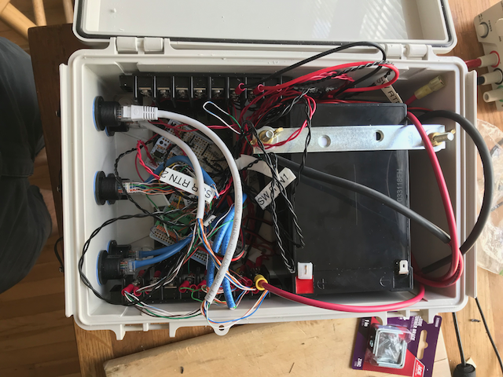
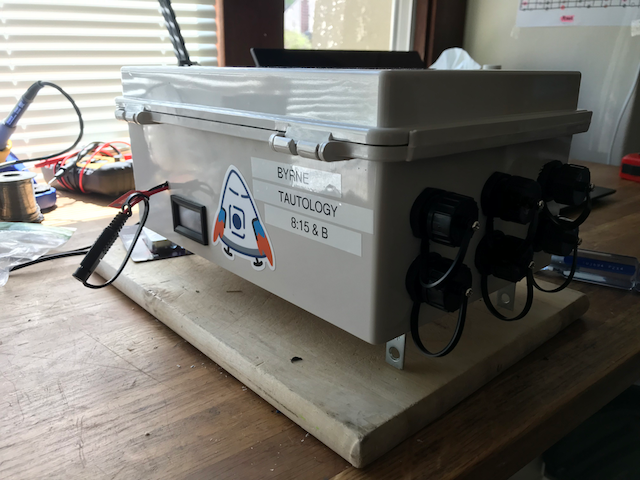
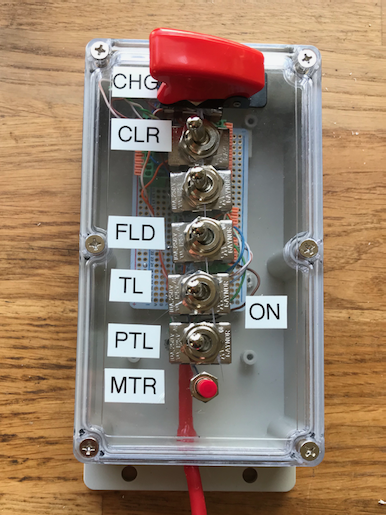

# Dustbike 2019

Project to put some custom lights on my crappy playa bike. 

## Key Parts

Part | Manufacturer | Manufacturer Part Number | Qty| Link 
-----|--------------|--------------------------|----|------
Controller | ST Micro | Nucleo-L432KC | 1 | [Digi-Key](https://www.digikey.com/product-detail/en/NUCLEO-L432KC/497-16592-ND/6132763/?itemSeq=297939740)
Color strips | Adafruit | "Dotstar" APA102 strip, 60 LEDs/m, 1m | 2 | [Adafruit](https://www.adafruit.com/product/2239?length=2)
Flood lights | "Lylla" | "Cree U5 LED"... | 1 | [Amazon](https://www.amazon.com/gp/product/B018FM5D0Q/ref=ox_sc_act_title_1?smid=A3W2SO842MQ1IS&psc=1)
Tail light | "Partsam" lol | "2x4.5 Inch Motorcycle LED"... | 1 | [Amazon](https://www.amazon.com/Partsam-4-5inch-Motorcycle-Universal-Running/dp/B01GRO844G/ref=sr_1_18?crid=1064ZRILUNPQC&keywords=red+led+bar&qid=1562956339&s=gateway&sprefix=red+led+bar%2Caps%2C176&sr=8-18)
Battery | ChromeBattery | zb-12-15 (15 Ah) | 1 | [Walmart](https://www.walmart.com/ip/12v-15ah-sealed-lead-acid-sla-battery-t2-terminals-for-zb-12-15/35451382)
Enclosure - Main Box | Bud Industries | NBF-32016 | 1 | [Amazon](https://www.amazon.com/gp/product/B005UPANU2/ref=ppx_yo_dt_b_asin_title_o01_s00?ie=UTF8&psc=1)  
Enclosure - Control Panel | "Awclub" | 6.2"x3.5"x1.8" | 1 | [Amazon](https://www.amazon.com/gp/product/B07NSV11XR/ref=ppx_yo_dt_b_asin_title_o01_s02?ie=UTF8&psc=1)
Passthrough connectors (RJ45) | "Anmbest" | "Shielded RJ45 Waterproof Cat5/Cat5c"... | 6 | [Amazon](https://www.amazon.com/gp/product/B07KSSV8LD/ref=ppx_yo_dt_b_search_asin_title?ie=UTF8&psc=1)
Solar charger | Renogy | 16W | 1 | [Amazon](https://www.amazon.com/gp/product/B07Q8G3T45/ref=ppx_yo_dt_b_search_asin_title?ie=UTF8&psc=1)
Hall sensor | ZF Electronics | MP101301 | 1 | [Allied Electronics](https://www.alliedelec.com/view/search?keyword=MP101301) 
5V Regulator | Bel Fuse | VRAE-10E1A0G | 1 | [Digi-Key](https://www.digikey.com/product-detail/en/VRAE-10E1A0G/507-1384-ND/1754625/?itemSeq=297936215)
NFETs (Used for Floods, Taillight, Panel voltmeter) | ST Micro | STP40NF03L | 3 | [Digi-Key](https://www.digikey.com/product-detail/en/STP40NF03L/497-3187-5-ND/654529/?itemSeq=301171507)
SSRs (Used to tie charger ground to system ground) | Toshiba Semiconductor | TLP3544(F) | 1 | [Digi-Key](https://www.digikey.com/product-detail/en/TLP3544(F)/TLP3544(F)-ND/3056609/?itemSeq=299990184)
Panel Voltmeter | "DROK" hahaha | "DC 2.7-30V Voltage Tester Meter 5V 9V 12V 24V" | 1 | [Amazon](https://www.amazon.com/DROK-2-7-30V-Digital-Voltmeter-Panel/dp/B07QWKLCX7/ref=sr_1_1_sspa?keywords=panel+voltmeter&qid=1565025037&s=gateway&sr=8-1-spons&psc=1&spLa=ZW5jcnlwdGVkUXVhbGlmaWVyPUFJQkEwTldSMjdSTTEmZW5jcnlwdGVkSWQ9QTA3NTEyMDMzTEZVUEc2Q0hSVThKJmVuY3J5cHRlZEFkSWQ9QTA4MTc5NzMyTk5FRkNVVkMzREI2JndpZGdldE5hbWU9c3BfYXRmJmFjdGlvbj1jbGlja1JlZGlyZWN0JmRvTm90TG9nQ2xpY2s9dHJ1ZQ==)

## Important Pinouts I Probably Shouldn't Forget

I mostly used T568B color/pin number mapping except for the color strips, where I didn't because I was young and foolish. 

Note that the RJ45 passthrough connectors look like they're pinned straight through, but they do actually cross over internally so pin 1 maps to pin 1. 

### Color Strips

Pin | Color | Signal
----|-------|--------
1 | Orange | 5V
2 | Orange/White | 5V
3 | Green/White | 5V
4 | Green | MOSI
5 | Blue/White | SCLK
6 | Blue | GND
7 | Brown/White | GND
8 | Brown | GND

### Floods

Pin | Color | Signal
1 | Orange | 12V
2 | Orange/White | 12V
3 | Green/White | 12V
4 | Blue | 12V
5 | Blue/White | Return
6 | Green | Return
7 | Brown/White | Return
8 | Brown | Return

### Control Panel

Pin | Color | Signal
----|-------|--------
1 | Orange/White | Switch 1 (Charge SSR and Panel Meter enable)
2 | Orange | Switch 2 (Color mode enable)
3 | Green/White | Switch 3 (Was wig-wag mode, removed when I found out lights had toggling modes and also burned up one of my NFETs)
4 | Blue | Switch 4 (Floods enable)
5 | Blue/White | Switch 5 (Taillight enable)
6 | Green | Switch 6 (Patrol mode enable)
7 | Brown/White | Pushbutton Switch 7 (was going to be meter enable, then I just tied that to switch 1 because I wanted to use serial debug and collided on pins)
8 | Brown | Ground

### Speed Sensor

Pin | Color | Signal
----|-------|--------
1 | Orange/White | 5V
2 | Orange | NC
3 | Green/White | NC
4 | Blue | NC
5 | Blue/White | NC
6 | Green | Signal (open drain)
7 | Brown/White | NC
8 | Brown | Ground

### Pinouts inside the box 

#### Controller I/O Terminal Block - Left Side 

Pin | Signal
----|--------
1 | SCLK
2 | SCLK
3 | SCLK
4 | MOSI
5 | MOSI
6 | MOSI
7 | SW2 Enable (Taillight Enable output)
8 | SSR1 Enable (Charge / Panel Meter enable)
9 | SW1 Enable (Left Flood enable, til I blew it up and put them together on SW3)
10 | SW3 Enable (Right Flood enable, then both)

#### Controller I/O Terminal Block - Right Side

Pin | Signal 
----|-------
1 | Speed In
2 | CTRL1
3 | CTRL2
4 | CTRL3
5 | CTRL4
6 | CTRL5
7 | CTRL6
8 | CTRL7
9 | SW4 Enable (Meter Enable, til I moved it I think)
10 | GND

## Images

Operating in Color mode with floods on: [YouTube](https://youtu.be/-PT2Iv_JQ2k)
Operating in Patrol mode with taillight on: [YouTube](https://youtu.be/xmnZ-JuauxY)

## Issues

Description | Workaround | Fix | Done? 
------------|------------|-----|------
Hall sensor doesn't work with the one MSR bike magnet Tip Top bikes in Oakland Stocks | Use a couple refrigerator magnets I had. | Source a sensor that detects North poles | 
Motorcycle flood lights have three modes and cycle through them on each power cycle (bright, dim, flash rapidly). | It's a feature. | Mod the lights or source some others |
Light pattern speed does not appear to match vehicle speed very well, if at all. | Whatever, it works. | Going to need some test fixturing or at least a test rider. |
Light pattern speed does not update smoothly, especially at low speed. | Whatever, it works. | Add more magnets, or an encoder! |
5V Supply gets quite hot, even at very low load. | Didn't break, doesn't matter. | Design a real board and replace reg. | 
Internal harnessing is a nightmare. | Whatever, it works. | Design a real board. Harness from inside of sealed passthrough connectors straight to board - no terminal blocks. |
Using same connector for 12V floods and 5V APA102 strings, as well as control panel and hall sensor. Swapping cables is more likely to be catastrophic than not. | Painted connectors and matching cables matching colors with some of Meb's nail polish. Still did it wrong once and had to replace stuff. | Use different connectors (something compatible with APA102 strings out of the box would be even nicer). | 
